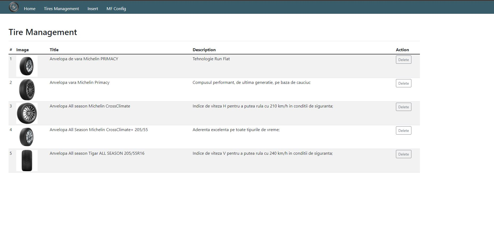
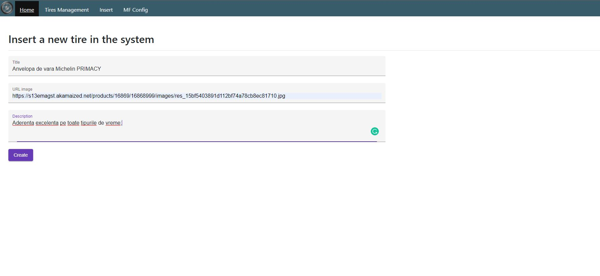
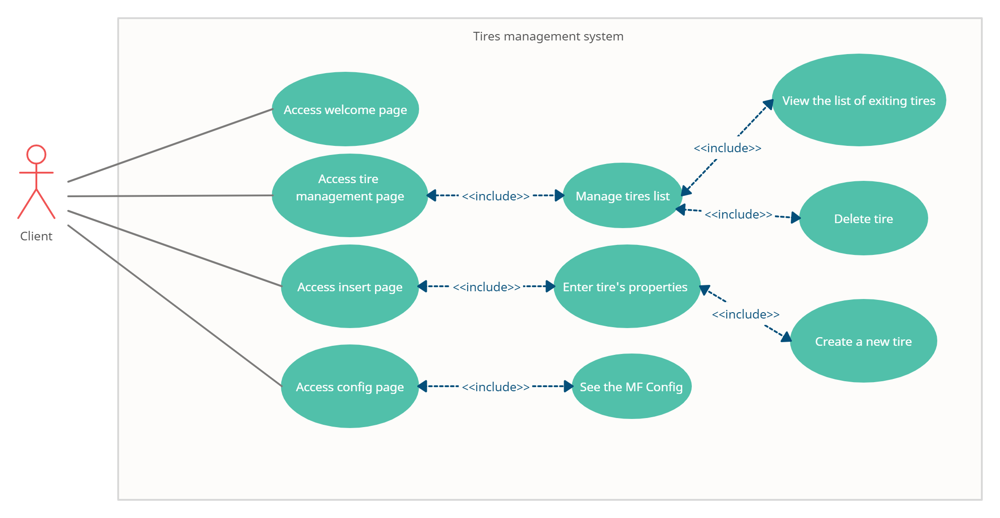
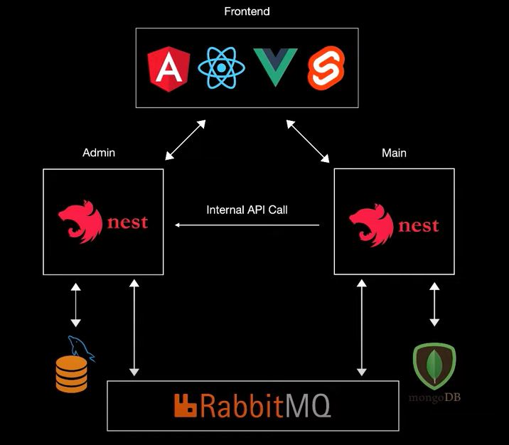
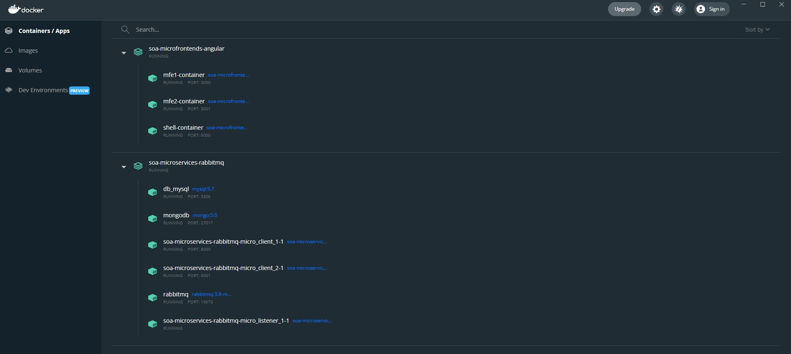
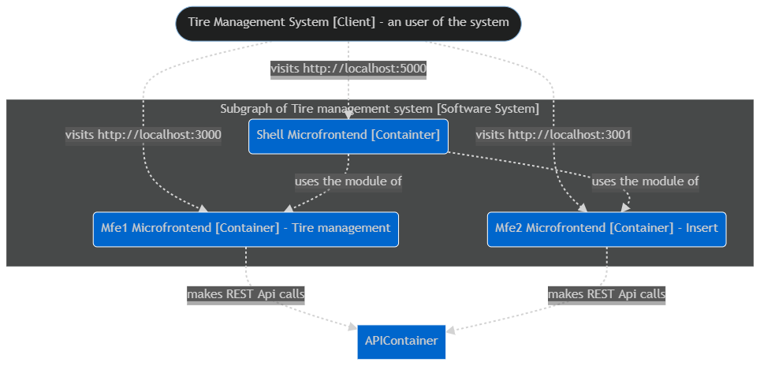
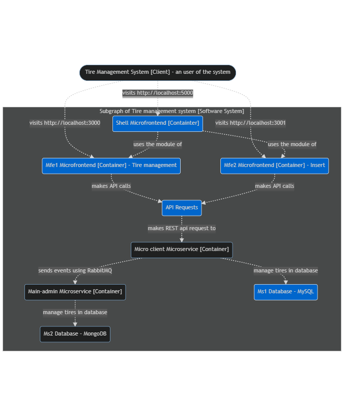

# Service Oriented Architecture Project 2021-2022
# Tires management system using NestJs microservices and Angular microfrontend components
# UBB, master, Software Engineering

## Web Application



## Description
Tires management system is an application based on microservices created in NestJs that communicates through the RabbitMq message broker.

At the frontend level, a micro frontend-based architecture is applied, using Angular components (with Webpack, Module Federation Plugin).

The system allows the management of tires (viewing, creating, deleting). These operations are grouped into two existing micro frontends: **Tire Management**, which allows you to view and delete a tire, and **Insert**, where you can insert a new tire into the system.

**TIRE entity** contains: Id (unique), Name, Image URL, Description.

Thus, when creating a new tire, a POST request is sent to microservice 1 - *micro-project-soa*, which creates a new entity in the MySql database. The Create **event is broadcast via RabbitMq** to microservice 2 - *main-app*, which also creates an entity in the related database, MongoDB.

In order to deploy the approach solution, we are using **docker images** for constructing the containers in order to build the microservices and microfrontends and access them on different ports.

## SOA Patterns

## SOA Fundamentals

## Microservices
- **micro-project-soa** 
    - NestJs microservice that manage CRUD operations on Tire entity; 
    - Connected with MySql.
- **main-app**
    - (Admin) NestJs microservice that manage CRUD operations on Tire entity; 
    - Connected with MongoDB;
    - Containes definition for **RabbitMQ** service listener.
    
## Microfrontends
- **mfe1** 
    - Consumes REST services exposed by the controller of the client's tire microservice.
    - Tires management dashboard
- **mfe2** 
    - Consumes REST services exposed by the controller of the client's tire microservice.
    - Contains the component for creating a new tire.
- **shell**
    - centralizes all the microfrontends (the main microfrontend)

## Secured REST Service

## Technologies:
- Microservices: NestJs (RabbitMq message broker)
- Microfrontends: Angular 12 (Webpack, Module Federation Plugin)
- Databases: MySql, MongoDB

## Use cases UML diagram


## General Arhitecture


## Docker
- For Microservices go to --> **SOA-microservices-RabbitMQ** and run: **docker-compose up**
    - Images: db_mysql - image for MySql, mongodb - image for MongoDb, soa-microservices-rabbitmq-micro_client_1-1 - image for ms1 - client,  soa-microservices-rabbitmq-micro_client_2-1 - image for ms2 - admin, 
    rabbitmq - image for RabbitMQ message broker, soa-microservices-rabbitmq-micro_listener_1-1 - image for nest listener service that is using Rabbit queue to send events. 
- For Microfrontends go to --> **SOA-microfrontends-Angular** and run: **docker-compose up**
    - Images: mf1-container - image for mf1 (tire management), mf2-container - image for mf2 (insert), 
    shell-container - image for grouping microfrontends (client's main frontend)



## Access application via Browser or Postman
- For microservices:
    - (run ``` docker-compose up ``` before)
    - Open Postman and try: (GET) localhost:8000/api/tires or localhost:8001/api/tires using a valid Bearer token.

- For microfrontends:
    - (run ``` docker-compose up ``` before)
    - open browser and access: localhost:3000, localhost:3001, localhost:5000

# C4 Models
## I. Container diagrams
### 1. RabbitMQ Arhitecture


### 2. Container Diagram for Angular Microfrontends


### 3. Container Diagram for the application


## Component diagram

### 1. Component Diagram for Microservices:


### 2. Component Diagram for Microfrontends:


## Code
### 1. Code Diagram for Microservices:


### 2. Code Diagram for Microfrontends:


# Conclusion 


## UBB Cluj-Napoca - Faculty of Mathematics and Computer Science
### Software Engineering, 2020 - 2022
- 2st year - 1st semester
- Software Oriented Architecture - Assessment
- Linca Razvan Cosmin - Group: 258-2